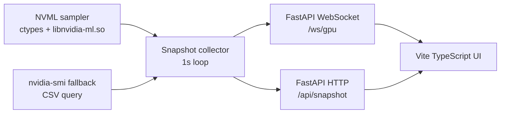

# 设计说明

## 目标

这套服务面向本机 NVIDIA GPU 环境的日常占用观察：页面必须实时、信息密度高、开销低，并且能在普通用户权限下长期运行。

## 架构

后端只有一个采样循环。浏览器连接数增加时，不会增加 NVML 调用次数，只会复用 collector 中的最新快照。

## 数据路径

1. 启动时初始化 `NVMLSampler`，加载 `libnvidia-ml.so`。
2. 每秒读取 GPU 名称、UUID、显存、利用率、温度、功耗、时钟、P-state、Compute Mode、ECC 和 MIG。
3. 进程枚举默认每 3 秒执行一次并缓存，降低多用户进程查询带来的抖动。
4. 如果 NVML 初始化或单次采样失败，关闭当前 NVML 句柄并执行 `nvidia-smi --query-gpu=... --format=csv,noheader,nounits`。
5. collector 给快照补充序号、刷新间隔和 120 点短历史数据。
6. WebSocket 客户端收到 JSON 后刷新 KPI、GPU 卡片、进程表和历史曲线。

## 低开销策略

- 不使用 `nvidia-smi -l` 常驻子进程，正常路径不每秒 fork。
- NVML 在服务进程内保持初始化状态，单 collector 串行采样。
- 进程列表降频采样，避免 `/proc` 和驱动进程查询影响核心指标刷新。
- 前端不依赖大型图表库，短曲线用 SVG polyline 绘制。
- 后端只保留最近 120 个采样点，不落盘，不写数据库。

## 普通用户权限

部署脚本只使用当前用户目录、`uv`、`npm` 和 `nohup`。不写 `/etc`，不调用 sudo。默认监听 `127.0.0.1`，通过 SSH `-L` 端口转发访问。

## 硬件自适应

项目不假设固定 GPU 数量或型号。GPU 数量、型号、显存、功耗上限、时钟、ECC、MIG 和进程信息都来自本机 NVML 采样结果；NVML 不可用时，再使用 `nvidia-smi --query-gpu` 的 CSV 输出兜底。前端根据快照中的 GPU 列表动态生成总览、卡片和进程表。

## 参考资料

- NVIDIA NVML API Reference Guide: https://docs.nvidia.com/deploy/nvml-api/index.html
- NVIDIA System Management Interface 文档: https://docs.nvidia.com/deploy/nvidia-smi/index.html
- Grafana dashboard gallery: https://grafana.com/grafana/dashboards/
