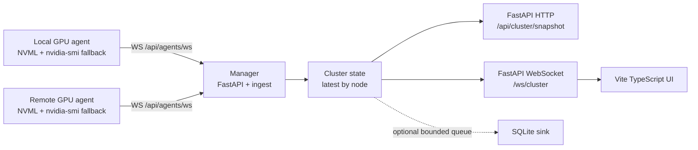

# 设计说明

## 目标

这套服务面向本机和小规模 GPU 集群的日常占用观察：页面必须实时、信息密度高、开销低，并且能在普通用户权限下长期运行。

## 架构

manager 不直接采样本机 GPU。启用本机监控时，服务脚本会额外启动一个 local agent；这个 agent 和远端 agent 使用同一条 WebSocket ingest、ClusterState、DB sink 和前端 API 路径。浏览器连接数增加时，不会增加 NVML 调用次数，只会复用 manager 中的最新 `ClusterSnapshot`。

manager 维护每个节点的 latest `NodeSnapshot`，再聚合成 `ClusterSnapshot` 推给前端。SSH 只用于安装、写配置、启动、停止和状态查询，不作为实时数据通道；agent 主动通过 WebSocket 回连 manager，不开放入站 HTTP 服务。

## 数据路径

1. 每个 GPU 节点 agent 启动时初始化 `NVMLSampler`，加载 `libnvidia-ml.so`。
2. 按全局刷新率读取 GPU 名称、UUID、显存、利用率、温度、功耗、时钟、P-state、Compute Mode、ECC 和 MIG；刷新率可在 Web 端切换为 0.5 秒、1 秒、2 秒或 5 秒。
3. 进程枚举默认每 3 秒执行一次并缓存，实际间隔不低于当前核心刷新率，降低多用户进程查询带来的抖动。
4. 如果 NVML 初始化或单次采样失败，关闭当前 NVML 句柄并执行 `nvidia-smi --query-gpu=... --format=csv,noheader,nounits`。
5. agent 内部 collector 给快照补充序号、当前刷新间隔和 120 点短历史数据。
6. agent 通过 `WS /api/agents/ws` 发送 `hello`、`sample` 和 `heartbeat`。
7. manager 按 `node_id` 维护 latest state，丢弃同节点旧 `seq`，并按本地接收时间标记 stale/offline。
8. manager 把接受的 `NodeSnapshot` 提交给可选 SQLite sink；本机 agent 与远端 agent 写库路径完全一致。
9. WebSocket 客户端收到 `ClusterSnapshot` 后刷新前端路由：`/overview` 只显示集群 KPI 和按节点拆分的 fabric 卡片；`/nodes/<node_id>` 只显示对应节点的 GPU 卡片、任务表和历史曲线。

## 低开销策略

- 不使用 `nvidia-smi -l` 常驻子进程，正常路径不每秒 fork。
- NVML 在 agent 进程内保持初始化状态，每个 GPU 节点只有一个 collector 串行采样。
- 刷新率是 manager 维护并广播给 agent 的运行时设置，浏览器切换不会创建额外 collector。
- 进程列表降频采样，避免 `/proc` 和驱动进程查询影响核心指标刷新。
- 前端不依赖大型图表库，短曲线用 SVG polyline 绘制。
- agent 只保留最近 120 个实时采样点；数据库为可选模块，并通过 manager 有界队列异步写入。

## 普通用户权限

manager 侧使用当前用户目录、`uv`、`npm` 和 `nohup`。本机 agent 由 `scripts/service/start.sh` 默认启动，也使用普通用户后台进程。远端 GPU 节点 agent 不要求安装 `uv`；manager 本地构建最小 agent runtime 后通过 SSH 同步，远端只需要 `python3 >= 3.10`、NVML/`nvidia-smi` 和普通用户权限。不写 `/etc`，不调用 sudo。默认监听 `127.0.0.1`，通过 SSH `-L` 端口转发访问。

## 硬件自适应

项目不假设固定 GPU 数量或型号。GPU 数量、型号、显存、功耗上限、时钟、ECC、MIG 和进程信息都来自本机 NVML 采样结果；NVML 不可用时，再使用 `nvidia-smi --query-gpu` 的 CSV 输出兜底。前端根据集群快照中的节点和 GPU 列表动态生成总览、节点矩阵、卡片和任务表。

## 阶段二数据契约

- `GpuInfo` 增加 `node_id` 和 `gpu_id`；`gpu_id` 默认由 `node_id + gpu uuid` 生成，避免多节点 GPU index 冲突。
- `GpuProcess` 增加 `task_name`、`exe`、`cmdline_hash`、`process_start_time`、`detail_status`，用于任务视图和 session 统计。
- `NodeSnapshot` 表示一个节点的最新状态，包含状态、agent 版本、采样/接收时间和节点 totals；管理节点可通过 `nodes.yaml` 顶层 `manager_hostname` 配置显示名。
- `ClusterSnapshot` 由 manager 生成，包含所有节点、集群 totals 和按 `gpu_id` keyed 的短历史曲线。

## 可选数据库

SQLite sink 默认关闭。启用后，实时链路仍然是 `agent sample -> manager latest state -> frontend websocket`；数据库写入走 `manager -> bounded queue -> SQLite writer`。

数据库长期价值围绕任务 session 和 rollup：

- `process_sessions`：用户任务生命周期。
- `process_gpu_usages`：多 GPU 任务与每张 GPU 的显存统计。
- `gpu_metric_rollups`：20 秒、2 分钟和 1 小时降采样曲线。
- `raw_snapshots`：低频调试快照，默认关闭，建议 12 小时保留。

原始 1 秒 GPU 指标不再写入 SQLite。DB sink 只在内存中保留正在聚合的 20 秒桶；桶关闭后写入 `gpu_metric_rollups`，再由维护任务聚合到 2 分钟和 1 小时粒度。`gpu_metric_samples` 表只为旧库兼容和一次性迁移保留，实时链路和新写入路径都不依赖它。

## 参考资料

- NVIDIA NVML API Reference Guide: https://docs.nvidia.com/deploy/nvml-api/index.html
- NVIDIA System Management Interface 文档: https://docs.nvidia.com/deploy/nvidia-smi/index.html
- Grafana dashboard gallery: https://grafana.com/grafana/dashboards/
