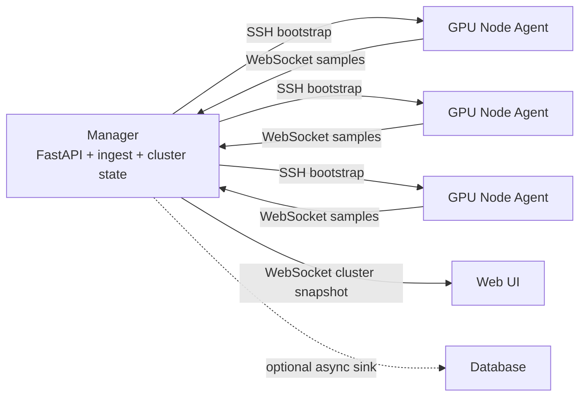

# Constella 阶段二设计计划

> 历史说明：本文记录阶段二的原始演进设计，其中“单机兼容 API”和“本机 Snapshot 包装为 Local NodeSnapshot”的过渡方案已在阶段 2.1 被废弃。当前实现以 `docs/plan_stage2.1.md` 为准：本机 GPU 也通过 local agent 上报到 manager，统一复用 Cluster API。

## 1. 当前状态

Constella 当前是单机 GPU 监控工具：

- 后端运行在目标 GPU 机器本机。
- 采集优先使用 NVML，失败时使用 `nvidia-smi` 兜底。
- 后端只有一个共享 collector，多个浏览器连接不会增加 GPU 采样次数。
- 前端通过 WebSocket 接收实时快照。
- 进程列表低频采样，短历史曲线只保存在内存中。
- 部署方式是普通用户级别，不依赖 sudo，不写系统目录。

阶段二的目标是在保留这些优点的前提下，把单机监控演进为多机集群监控。

## 2. 阶段二目标

### 2.1 核心目标

1. 支持一个管理节点监控多台 GPU 节点。
2. 管理节点一键启动所有 GPU 节点上的 agent，不要求用户逐台登录启动。
3. agent 在 GPU 节点上独立运行，低开销采集本机 GPU 和进程信息。
4. agent 主动连接 manager，通过长连接持续回传节点快照。
5. manager 实时维护每个节点的最新状态，聚合为集群快照并推送给前端。
6. 数据库作为可选模块，用于用户级任务耗时、任务时间线、GPU 历史曲线和后续分析。
7. 前端从单机 dashboard 演进为集群 dashboard，支持概览、节点详情、GPU 详情、用户任务视图。

### 2.2 设计原则

- 低开销优先：正常路径不高频 fork，不高频写完整快照到硬盘。
- 普通用户可部署：不依赖 sudo，不要求 system service，不写 `/etc`。
- SSH 只做启动和控制，不做持续采集数据通道。
- agent 到 manager 的数据通道使用 WebSocket 长连接。
- manager 不等待所有节点齐全，每个节点独立更新，慢节点标记 stale/offline。
- 实时展示靠内存 latest state，长期分析靠 session 和 rollup，不靠长期保存完整快照。
- schema 先行，采集、传输、存储、前端都围绕稳定数据契约演进。

### 2.3 非目标

阶段二第一版不做以下事情：

- 不做 C++ agent 重写，除非后续 benchmark 证明 Python 路径成为瓶颈。
- 不引入 Kubernetes、Kafka、Prometheus、复杂消息队列。
- 不强制使用 root/systemd system service。
- 不长期保存每 0.5s/1s 的完整 JSON 快照。
- 不把 SSH 作为实时采样或数据传输方案。
- 不直接绑定某个调度器，例如 Slurm/PBS/Kubernetes Job。后续可以作为增强字段接入。

## 3. 总体架构

阶段二采用 manager-agent 架构。



关键拆分：

- SSH 是控制面：安装、同步、写配置、启动、停止、查看日志。
- WebSocket 是数据面：hello、heartbeat、sample、config、ack。
- manager 是唯一对前端暴露 API 的服务。
- agent 不开放入站端口，agent 主动连接 manager。

## 4. 组件设计

### 4.1 Manager

manager 运行在管理节点上，职责包括：

- 提供 Web 前端、HTTP API 和 WebSocket API。
- 读取节点清单，例如 `nodes.yaml`。
- 一键通过 SSH 启动各节点 agent。
- 接收 agent WebSocket 连接。
- 鉴权 agent token。
- 维护每个节点的 latest snapshot。
- 处理乱序、断线、延迟、stale/offline 状态。
- 聚合集群 totals 和 history。
- 向前端推送 `ClusterSnapshot`。
- 可选把样本送入数据库写入队列。

manager 不应该做：

- 不通过 SSH 高频执行 `nvidia-smi`。
- 不等待所有节点返回后才更新集群快照。
- 不在 ingest 主路径同步写数据库。

### 4.2 Agent

agent 运行在 GPU 节点上，职责包括：

- 复用当前 `NVMLSampler` 采集本机 GPU 指标。
- 保留 `nvidia-smi` fallback。
- 采集 GPU 进程明细，包括用户、PID、进程名、命令行、启动时间、显存占用。
- 按配置频率生成 `NodeSnapshot`。
- 主动连接 manager 的 agent WebSocket endpoint。
- 断线自动重连。
- 接收 manager 下发配置，例如 refresh interval。
- 写轻量 state 文件供 watchdog 或 SSH status 查询。

agent 不应该做：

- 不在本机长期保存采集历史。
- 不在网络断开时无限积压样本。
- 不在每次采样时启动新的 `nvidia-smi` 常驻轮询进程。
- 不暴露 HTTP server，除非后续有明确需求。

## 5. SSH 一键启动设计

用户希望在管理节点上一键启动所有 agent，不逐台登录。

推荐命令：

```bash
constella cluster start --nodes nodes.yaml
```

节点清单示例：

```yaml
manager_hostname: manager-node
manager_url: ws://manager-host:8765/api/agents/ws
agent_token_file: run/agent-token
nodes:
  - id: gpu-node-01
    host: gpu-node-01
    user: alice
  - id: gpu-node-02
    host: gpu-node-02
    user: alice
```

一键启动流程：

1. manager 本地启动或确认已运行。
2. 读取 `nodes.yaml`。
3. 并发 SSH 到每个节点。
4. 在远端用户目录创建目录：

   ```text
   ~/.constella/
     agent/
     run/
     logs/
   ```

5. 同步 agent 代码或 wheel 包。
6. 写入远端私有 env 文件：

   ```text
   ~/.constella/run/agent.env
   ```

7. env 文件权限设置为 `600`。
8. 远端执行 `start_agent.sh`。
9. agent 通过 WebSocket 反连 manager。
10. manager 页面显示节点状态：starting、online、failed、stale、offline。

token 不应放在命令行参数里，避免出现在 `ps` 中。远端配置使用环境文件：

```bash
CONSTELLA_NODE_ID=gpu-node-01
CONSTELLA_MANAGER_URL=ws://manager-host:8765/api/agents/ws
CONSTELLA_AGENT_TOKEN=...
CONSTELLA_REFRESH_SECONDS=1.0
CONSTELLA_PROCESS_SECONDS=3.0
```

### 5.1 agent 持续运行

第一版优先使用普通用户级 nohup 启动方式，和当前项目部署风格一致：

```text
~/.constella/run/agent.pid
~/.constella/logs/agent.log
```

远端 `start_agent.sh` 必须幂等：

- pid 存在且进程存活：直接返回 running。
- pid 过期：清理 pid 并重启。
- agent 启动后写 pid 和日志。

可选增强：

- `systemd --user` service 模板。
- `crontab @reboot` 兜底。
- 轻量 watchdog 每 60 秒检查 pid 和 state 文件。

不用 sudo 的限制：

- 节点重启后 agent 不一定自动恢复。
- 解决方案是管理节点再次执行 `constella cluster start`，或启用 `systemd --user`/`crontab @reboot`。

## 6. Agent 稳定性和低开销

agent 进程内部建议拆为三个循环：

```text
agent process
  sampler loop
  websocket loop
  state writer
```

### 6.1 Sampler loop

- 持有一个长期 NVMLSampler。
- 按 `refresh_interval` 采样 GPU 核心指标。
- 进程列表按 `process_interval` 降频采样。
- 只更新 latest snapshot slot。
- 不因为网络发送阻塞采样。

### 6.2 WebSocket loop

- 连接 manager。
- 发送 `hello`。
- 持续发送最新 sample 或 heartbeat。
- 断开后指数退避重连：

  ```text
  1s -> 2s -> 5s -> 15s -> 30s
  ```

- 添加 jitter，避免大量节点同时重连。
- manager 离线时不积压历史。

### 6.3 队列策略

agent 不使用无限队列。

推荐：

```text
sample loop -> latest snapshot slot -> websocket loop
```

如果用队列，必须有界，例如 `maxsize=1`。新样本覆盖旧样本，保证实时性优先。

### 6.4 state 文件

agent 定期写：

```json
{
  "node_id": "gpu-node-01",
  "pid": 12345,
  "status": "online",
  "last_sample_at": 1782800000.1,
  "last_sent_at": 1782800000.2,
  "last_error": null
}
```

这个文件用于：

- SSH status 查询。
- watchdog 判断 agent 是否卡死。
- 排查节点问题。

## 7. WebSocket 通信协议

### 7.1 Endpoint

agent 连接：

```text
WS /api/agents/ws
```

前端连接：

```text
WS /ws/cluster
```

前端不直接连接 agent。

### 7.2 AgentHello

```json
{
  "type": "hello",
  "schema_version": 1,
  "node_id": "gpu-node-01",
  "hostname": "gpu-node-01",
  "agent_version": "0.2.0",
  "capabilities": {
    "nvml": true,
    "nvidia_smi_fallback": true,
    "process_cmdline": true
  }
}
```

### 7.3 AgentSample

```json
{
  "type": "sample",
  "schema_version": 1,
  "node_id": "gpu-node-01",
  "seq": 123,
  "sampled_at": 1782800000.12,
  "refresh_interval": 1.0,
  "snapshot": {
    "source": "nvml",
    "elapsed_ms": 6.4,
    "gpus": []
  }
}
```

### 7.4 AgentHeartbeat

```json
{
  "type": "heartbeat",
  "schema_version": 1,
  "node_id": "gpu-node-01",
  "seq": 124,
  "timestamp": 1782800001.12
}
```

### 7.5 ManagerAck

```json
{
  "type": "ack",
  "seq": 123
}
```

### 7.6 ManagerConfig

```json
{
  "type": "config",
  "refresh_interval": 2.0,
  "process_interval": 5.0
}
```

## 8. Schema 抽象

阶段二必须先抽象 schema，避免后续采集、存储、前端各自发散。

### 8.1 身份字段

不能再用 GPU index 作为全局主键。

推荐身份：

```text
node_id: 稳定节点 ID，来自 nodes.yaml 或 agent 配置
gpu_uuid: NVML GPU UUID
gpu_id: node_id + gpu_uuid
process_instance_id: node_id + pid + process_start_time
```

`index` 只用于展示。

### 8.2 NodeSnapshot

```python
NodeSnapshot:
  node_id: str
  hostname: str
  seq: int
  sampled_at: float
  received_at: float | None
  refresh_interval: float
  process_interval: float
  status: "online" | "stale" | "offline" | "error"
  source: "nvml" | "nvidia-smi" | "none"
  gpus: list[GpuInfo]
  totals: NodeTotals
  error: str | None
  agent_version: str | None
```

### 8.3 ClusterSnapshot

```python
ClusterSnapshot:
  ok: bool
  seq: int
  timestamp: float
  nodes: list[NodeSnapshot]
  totals: ClusterTotals
  history: dict[gpu_id, series]
```

`ClusterSnapshot` 由 manager 生成，不由 agent 直接上报。

### 8.4 GpuInfo

当前 `GpuInfo` 大体可复用，但需要明确：

```text
node_id
gpu_id
uuid
index
pci_bus_id
name
utilization_gpu
utilization_mem
memory_total_mb
memory_used_mb
memory_free_mb
temperature_c
power_watts
power_limit_watts
clock_sm_mhz
clock_mem_mhz
pstate
compute_mode
mig_mode
ecc_mode
processes
```

### 8.5 GpuProcess

阶段二不再默认把其他用户聚合到 `other_users`。集群运维和任务分析需要每个任务有明确命名。

统一进程明细模型：

```text
pid
user
name
task_name
exe
cmdline
cmdline_hash
gpu_memory_mb
kind
runtime_seconds
process_start_time
detail_status
detail_error
```

任务命名优先级：

1. 从 cmdline 提取脚本或任务名，例如 `train.py`、`serve.py`、`torchrun`。
2. `exe` basename。
3. `/proc/<pid>/comm`。
4. `nvidia-smi process_name`。
5. `unknown:<pid>`。

普通用户可能无法读取所有进程的完整 cmdline，这取决于系统 `/proc` 挂载和安全策略。读不到时仍然保留进程行：

```text
user=alice
pid=1234
task_name=python
cmdline=null
detail_status=permission_denied
```

可保留配置项：

```text
PROCESS_DETAIL_MODE=all
PROCESS_DETAIL_MODE=names
PROCESS_DETAIL_MODE=aggregate
```

默认建议为 `all`：尽力展示所有可读进程明细。

### 8.6 Totals

`NodeTotals`：

```text
gpu_count
active_processes
avg_gpu_utilization
avg_memory_utilization
memory_used_mb
memory_total_mb
power_watts
power_limit_watts
max_temperature_c
```

`ClusterTotals`：

```text
node_count
online_node_count
stale_node_count
offline_node_count
gpu_count
active_processes
avg_gpu_utilization
avg_memory_utilization
memory_used_mb
memory_total_mb
power_watts
power_limit_watts
max_temperature_c
```

集群平均 GPU 利用率默认按 GPU 简单平均，不按节点平均。

## 9. Manager Ingest 设计

manager ingest 负责接收 agent 上报并维护最新集群状态。

内存状态：

```python
latest_by_node = {
  "gpu-node-01": NodeRuntime(
    snapshot=NodeSnapshot(...),
    last_seq=123,
    connected=True,
    last_seen_at=...,
    status="online",
  )
}
```

处理流程：

1. agent 建立 WebSocket。
2. manager 验证 token。
3. agent 发送 hello。
4. manager 注册 node runtime。
5. agent 发送 sample。
6. manager 补 `received_at`。
7. manager 检查 `seq`，丢弃同节点旧样本。
8. 更新 `latest_by_node[node_id]`。
9. 重算 `ClusterSnapshot`。
10. 唤醒前端 `/ws/cluster`。
11. 可选把样本送入 DB writer queue。

### 9.1 延迟和乱序

规则：

- 同一 `node_id` 下，`seq <= last_seq` 的 sample 丢弃。
- `received_at - sampled_at` 用于展示延迟。
- manager 状态判定使用 `received_at` 和 manager 本地时间，不依赖节点时钟完全准确。
- `now - last_seen_at > stale_after` 标记 stale。
- `now - last_seen_at > offline_after` 标记 offline。

推荐默认：

```text
stale_after = max(3 * refresh_interval, 5s)
offline_after = max(10 * refresh_interval, 30s)
```

manager 不等待所有节点齐全。任何节点更新都会生成新的集群状态。

### 9.2 前端推送

前端 WebSocket 仍然使用 latest-only 语义：

- 浏览器慢时不排队发送所有历史 cluster snapshot。
- 只发送最新状态。
- 避免大量节点或慢浏览器导致内存上涨。

## 10. 数据库设计

数据库是可选模块，不能耦合实时路径。

实时链路：

```text
agent sample -> manager latest state -> frontend websocket
```

数据库链路：

```text
agent sample -> manager -> bounded DB queue -> async DB writer
```

DB writer 慢时不能拖垮实时监控。

### 10.1 数据库目标

数据库要支持：

- 每个用户的每个任务耗时。
- 每个任务的开始、结束、最后出现时间。
- 每个任务使用了哪些 GPU。
- 多 GPU 任务的每张卡显存占用统计。
- GPU 利用率、显存、功耗、温度的历史曲线。
- 按用户、节点、GPU、时间范围做分析。

数据库不应长期保存：

- 高频完整 JSON 快照。
- 每个 WebSocket payload。
- 可从 session 和 rollup 重建的大量重复信息。

### 10.2 推荐数据分层

```text
内存 latest state: 实时展示
内存 ring buffer: 最近 5-30 分钟调试
raw_snapshots: 可选，低频抽样，保留 12 小时
gpu_metric_samples: 短期原始指标点
gpu_metric_rollups: 中长期降采样曲线
process_sessions: 长期任务生命周期
process_gpu_usages: 长期任务和 GPU 关系
```

### 10.3 Raw snapshots 策略

`raw_snapshots` 只用于调试，并且默认关闭或低频写入。

要求：

- 不直接高频把每个完整快照写入硬盘。
- retention 固定为 12 小时。
- 写入方式为抽样和批量写入。
- 建议写入间隔为 10s 或 30s。
- 可以只在 debug mode 下开启。

原因：

- 高频写完整 JSON 会增加硬盘写放大。
- 完整快照长期分析价值低。
- 长期价值应由 session 和 rollup 承担。

### 10.4 表设计

#### nodes

```text
node_id primary key
hostname
display_name
first_seen_at
last_seen_at
agent_version
status
```

#### gpus

```text
gpu_id primary key
node_id
uuid
index
pci_bus_id
name
memory_total_mb
first_seen_at
last_seen_at
```

#### gpu_metric_samples

短期原始 GPU 指标点，保留较短时间，例如 24-72 小时。

```text
sampled_at
node_id
gpu_uuid
utilization_gpu
utilization_mem
memory_used_mb
memory_total_mb
power_watts
power_limit_watts
temperature_c
sample_count
```

#### gpu_metric_rollups

长期曲线数据。

```text
bucket_start
bucket_seconds
node_id
gpu_uuid
avg_gpu_utilization
max_gpu_utilization
avg_memory_used_mb
max_memory_used_mb
avg_power_watts
max_power_watts
avg_temperature_c
max_temperature_c
sample_count
```

#### process_sessions

一个进程实例对应一个 session。

```text
session_id primary key
node_id
pid
process_start_time
user
task_name
process_name
exe
cmdline_hash
cmdline_text
first_seen_at
last_seen_at
duration_seconds
status
sample_count
```

`session_id` 推荐由以下字段生成：

```text
node_id + pid + process_start_time
```

不要只用 PID，因为 PID 会复用。

#### process_gpu_usages

支持多 GPU 任务。一个 session 可以对应多张 GPU。

```text
session_id
node_id
gpu_uuid
first_seen_at
last_seen_at
max_memory_mb
avg_memory_mb
last_memory_mb
sample_count
primary key(session_id, gpu_uuid)
```

示例：

```text
process_sessions:
  session_id=train-abc
  user=alice
  task_name=train.py
  duration=3h

process_gpu_usages:
  train-abc GPU-0 max_memory=38GB
  train-abc GPU-1 max_memory=39GB
  train-abc GPU-2 max_memory=37GB
  train-abc GPU-3 max_memory=38GB
```

查询用户每个任务耗时看 `process_sessions`。

查询任务用了哪些 GPU 看 `process_gpu_usages`。

查询 GPU 历史曲线看 `gpu_metric_rollups`。

### 10.5 Rollup 策略

建议保留策略：

```text
raw_snapshots: 12 小时，低频抽样，默认关闭
gpu_metric_samples: 24-72 小时
rollup_10s: 7-14 天
rollup_1m: 3-12 个月
rollup_1h: 长期保留
process_sessions: 长期保留
process_gpu_usages: 长期保留
```

后台压缩任务：

```text
每 10 秒:
  gpu_metric_samples -> 10s rollup

每 1 分钟:
  10s rollup -> 1m rollup

每 1 小时:
  1m rollup -> 1h rollup

每天:
  删除过期 raw_snapshots
  删除过期 raw samples
  关闭长时间未见的 running session
  vacuum/analyze 或数据库维护
```

### 10.6 写入优先级

DB queue 有界，避免数据库慢拖垮 manager。

优先级：

```text
最高: process_sessions / process_gpu_usages
中等: gpu_metric_rollups
较低: gpu_metric_samples
最低: raw_snapshots
```

队列满时：

- 不能丢 session 生命周期事件。
- 可以丢 raw snapshot。
- 可以对 raw metric 做采样降级。

### 10.7 数据库选型

第一版可选两条路线：

#### SQLite + WAL

优点：

- 无服务依赖。
- 普通用户可直接使用。
- 适合小集群或单管理节点轻量分析。

限制：

- 高并发写入能力有限。
- 大规模长期时间序列查询不如 PostgreSQL。

#### PostgreSQL

优点：

- 更适合多节点长期分析。
- 索引、分区、并发写入更成熟。
- 后续可接 TimescaleDB。

限制：

- 部署成本高于 SQLite。
- 可能需要额外服务管理。

建议：

- 阶段二第一版实现 DB sink 抽象。
- 默认 SQLite 可用。
- 预留 PostgreSQL sink。
- 数据库模块默认可关闭。

## 11. 前端设计

前端从单机 dashboard 演进为集群 dashboard。

### 11.1 页面结构

推荐页面：

1. Cluster Overview
   - 路径为 `/overview`。
   - 总节点数、在线节点数、GPU 总数、总显存、总功耗、活跃任务数。
   - Cluster fabric 按节点拆分为独立卡片，每个卡片只展示该节点自己的 GPU 状态。
   - stale/offline 节点提示。

2. Node Detail
   - 路径为 `/nodes/<node_id>`。
   - 单节点的 GPU 卡片。
   - 节点延迟、agent 状态、驱动版本、CUDA/NVML 版本。
   - 当前进程表。

3. GPU Detail
   - 单张 GPU 历史曲线。
   - 当前占用进程。
   - 温度、功耗、显存、利用率详情。

4. Users / Tasks
   - 当前活跃任务。
   - 用户任务历史。
   - 每个任务耗时、GPU 列表、显存峰值。

### 11.2 前端数据源

实时：

```text
WS /ws/cluster
```

历史：

```text
GET /api/history/gpu
GET /api/history/tasks
GET /api/users
```

保留单机兼容 API：

```text
GET /api/snapshot
WS /ws/gpu
```

在单机模式下，可把本机视为一个 `NodeSnapshot`，再包装为 `ClusterSnapshot`。

## 12. 兼容性设计

阶段二不能一次性打破当前单机模式。

推荐兼容层：

```text
当前 Snapshot -> Local NodeSnapshot -> ClusterSnapshot(nodes=[local])
```

这样可以先在单机模式下跑通新 schema 和新前端，再接远程 agent。

保留：

- `constella serve`
- `GET /api/snapshot`
- `WS /ws/gpu`

新增：

- `constella agent`
- `constella cluster start`
- `constella cluster stop`
- `constella cluster status`
- `WS /api/agents/ws`
- `WS /ws/cluster`
- `GET /api/cluster/snapshot`

## 13. 安全设计

### 13.1 Agent 鉴权

- agent 使用 token 连接 manager。
- token 不放命令行。
- token 存远端 `600` 权限 env 文件。
- manager 拒绝无 token 或 token 错误的连接。

### 13.2 SSH

- 使用用户自己的 SSH key。
- 不要求 sudo。
- SSH 只用于启动、停止、状态、日志。
- 不通过 SSH 高频传输采样数据。

### 13.3 进程信息

默认 `PROCESS_DETAIL_MODE=all`，尽力显示所有可读进程明细。

需要承认限制：

- 普通用户未必能读取所有用户完整 cmdline。
- 读不到时仍显示 PID、user、process name、task_name fallback。
- 不应因为读不到 cmdline 就聚合掉进程。

## 14. 性能策略

### 14.1 Agent

- 正常路径使用长期 NVML sampler。
- 进程列表降频采样。
- WebSocket 单长连接。
- 网络断开时不积压历史。
- 日志限量。
- `nvidia-smi` 仅 fallback 或权限不足时使用。

### 14.2 Manager

- latest state 存内存。
- cluster snapshot latest-only 推送。
- DB 写入异步。
- DB queue 有界。
- 大量节点下避免每次 sample 全量重算昂贵结构，可后续增量优化。

### 14.3 数据库

- 高频完整快照不直接写盘。
- raw snapshot 低频抽样，保留 12 小时。
- 时间序列做 rollup。
- session 长期保留。

## 15. 测试计划

### 15.1 Schema 测试

- 单机 Snapshot 可以转换为 NodeSnapshot。
- 多个 NodeSnapshot 可以聚合为 ClusterSnapshot。
- GPU key 使用 `node_id + uuid`，不同节点 index 相同不冲突。
- process session id 使用 `node_id + pid + process_start_time`，避免 PID 复用。

### 15.2 Manager ingest 测试

- hello 注册节点。
- sample 更新 latest_by_node。
- 同节点旧 seq 被丢弃。
- heartbeat 更新 last_seen。
- 超时节点变 stale/offline。
- 某节点 error 不影响其他节点。

### 15.3 Agent 测试

- 断线自动重连。
- manager 不可达时不积压无限队列。
- 采样循环不被发送循环阻塞。
- state 文件定期更新。

### 15.4 数据库测试

- process_sessions 正确创建和关闭。
- 多 GPU 任务生成一条 session 和多条 process_gpu_usages。
- rollup 计算 avg/max/sample_count 正确。
- raw_snapshots retention 为 12 小时。
- DB writer 慢时不阻塞 ingest。

### 15.5 前端测试

- 集群概览可展示 online/stale/offline 节点。
- 多节点 GPU index 相同仍能正确区分。
- 进程表展示所有可读任务明细。
- 长 task name/cmdline 不撑破布局。

## 16. 实施里程碑

### Phase 2A: Schema 和单机兼容

- 新增 NodeSnapshot、ClusterSnapshot、NodeTotals、ClusterTotals。
- 当前 Snapshot 包装为 Local NodeSnapshot。
- 新增 `/api/cluster/snapshot` 和 `/ws/cluster`，先只返回本机。
- 前端可以在单机模式消费 ClusterSnapshot。

验收：

- 当前单机功能不退化。
- 新 cluster API 在单机模式工作。

### Phase 2B: Manager ingest

- 新增 `/api/agents/ws`。
- 实现 AgentHello、AgentSample、AgentHeartbeat。
- 实现 latest_by_node、seq 去重、stale/offline。
- 用模拟 agent 测试多节点。

验收：

- 无真实 GPU 节点时也能用模拟 agent 验证 manager。
- 乱序和断线行为符合预期。

### Phase 2C: Agent

- 新增 `constella agent`。
- agent 复用 NVMLSampler。
- 实现 WebSocket 连接、hello、sample、heartbeat、重连。
- 写 agent state 文件。

验收：

- 单台远程 GPU 节点可反连 manager。
- manager 能展示该节点实时数据。

### Phase 2D: SSH cluster start

- 新增 `nodes.yaml` 支持。
- 新增 `constella cluster start/status/stop`。
- SSH 同步 agent、写 env、远端 nohup 启动。
- 幂等启动。

验收：

- 管理节点一条命令启动多台 GPU 节点 agent。
- 不需要 sudo。
- 重复执行不会重复启动 agent。

### Phase 2E: Cluster UI

- Cluster Overview。
- Node Detail。
- 进程/任务实时列表。
- stale/offline 视觉状态。

验收：

- 多节点多 GPU 可以清晰扫描。
- 延迟、错误、离线状态明确。

### Phase 2F: Database sink

- 实现 DB sink 接口。
- SQLite 第一版。
- process_sessions。
- process_gpu_usages。
- gpu_metric_samples。
- gpu_metric_rollups。
- raw_snapshots 低频抽样，12 小时 retention。

验收：

- 可以查询用户每个任务耗时。
- 可以查询任务使用了哪些 GPU。
- 可以查询 GPU 历史曲线。
- 关闭数据库时实时监控不受影响。

## 17. 后续增强

后续可以考虑：

- PostgreSQL/TimescaleDB sink。
- Slurm/PBS/Kubernetes job 信息接入。
- 管理节点 UI 直接启动/停止节点 agent。
- agent 自动升级。
- 更细的 per-process GPU utilization，如果驱动和权限允许。
- C++/Rust agent，前提是 benchmark 证明 Python agent 成为瓶颈。

## 18. 最终建议

阶段二应按以下顺序推进：

1. 先抽象 schema。
2. 再做 manager ingest。
3. 再做 agent。
4. 再做 SSH 一键启动。
5. 再做集群前端。
6. 最后接数据库和历史分析。

关键设计结论：

- SSH 是一键部署和启动工具，不是实时数据通道。
- WebSocket 是 agent 和 manager 的持续通信方式。
- manager 维护每个节点最新状态，不等待所有节点同步。
- 数据库默认不高频写完整快照。
- raw_snapshots 只做调试，低频抽样，保留 12 小时。
- 用户任务统计以 process session 为核心。
- 多 GPU 任务用 `process_sessions + process_gpu_usages` 表达。
- 进程明细默认尽力展示所有可读任务，不再默认聚合其他用户进程。
